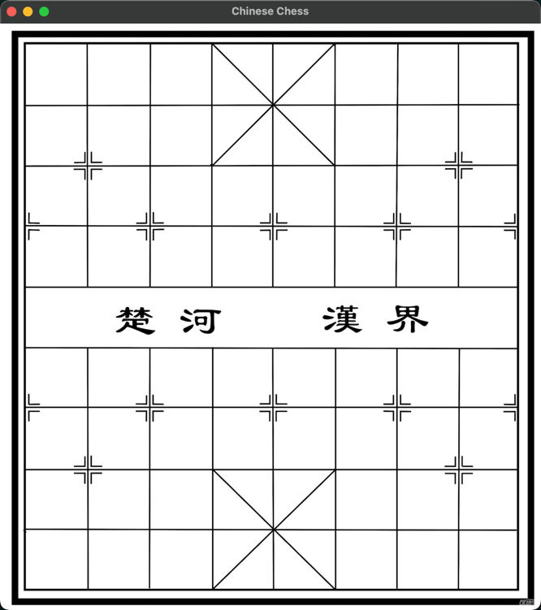

# Chinese Chess
A Chinese Chess game written in C++ with SFML

* operation 1
* operation 2

## Demo
* Demo 1
 

## Design
change the repo name:
Can be found in [https://github.com/hanbintan2003/SFML_Template/blob/main/design.txt]

## Features

- feature 1
- feature 2
